

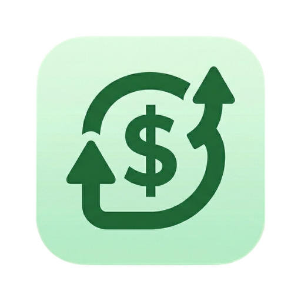

# 💸 Filous | فلوس

### A Smart, Minimalist, and Clean Budget/Spendings Tracker for Android

 

 

[**Download**](#download-now) · [**Features**](#features) · [**Screenshots**](#screenshots) · [**Support**](#support-the-project)

> [!WARNING]
> **SMS Permissions** - Filous needs access to _read your SMS_ to *intercept payment information*.
> **Battery Optimization** - Filous needs unrestricted access to run in the background to allow for _SMS interception_ and also to keep you **logged in** at _all times_.

> [!NOTE]
> **_DISCLOSURE_** - Filous does **NOT** send off any data from your device, everything stays **local** and **ON your device**.

---

## 🚀 Features

* **Dual Tracking Modes** — Choose between a goal-oriented **Budget Tracker** (categorized) or a detailed **Spending Tracker** (ledger style).
* **Automatic SMS Logging** — Effortlessly record transactions in **real-time** by automatically parsing incoming bank SMS notifications.
* **Smart Categorization** — An *intelligent heuristic engine* automatically guesses transaction categories based on <b>merchant details</b>.
* **Visual Insights** — Stay on top of your finances with **live charts** and **progress bars** that *visualize* your spending habits.
* **Multi-Currency Support** — Track spending across **50+ currencies** with live, automated exchange rate fetching.
* **Modern Material 3 Design** — A clean, modern interface featuring **Material You** dynamic coloring and customizable themes.
* **Privacy First** — All your financial data is stored **securely**, and **locally** ON your device using **high-performance storage**.
* **Reliable Backups** — Keep your data safe with **flexible manual exports** and **scheduled automatic backups** (Daily/Weekly/Monthly).

---

<h1>Screenshots</h1>

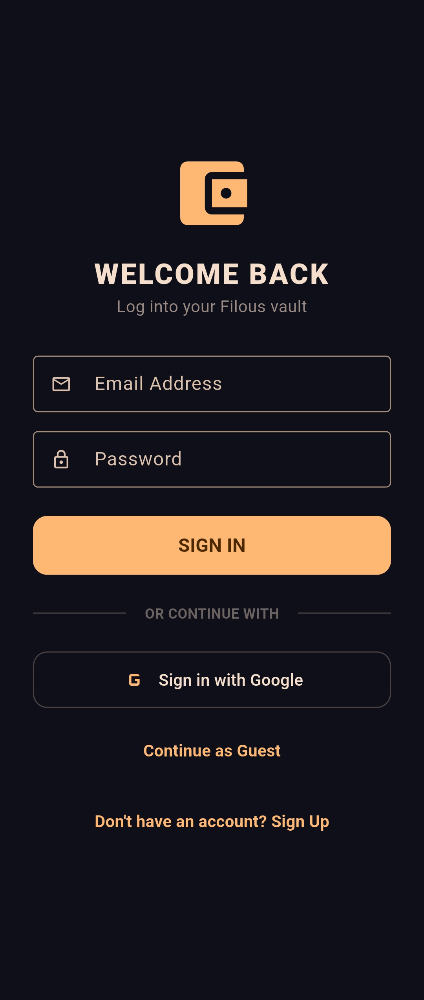

<h2>Budget Mode</h2>
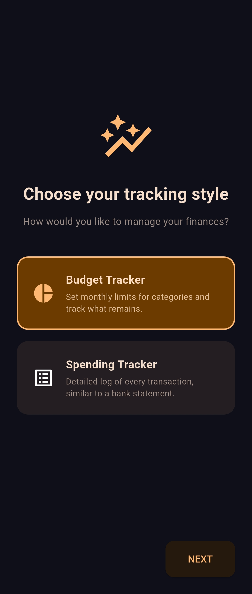
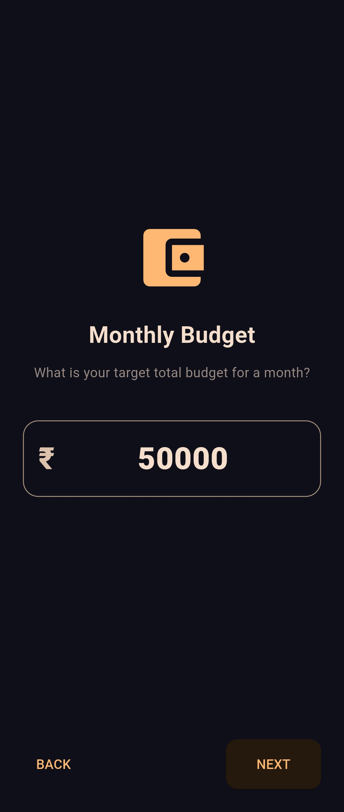
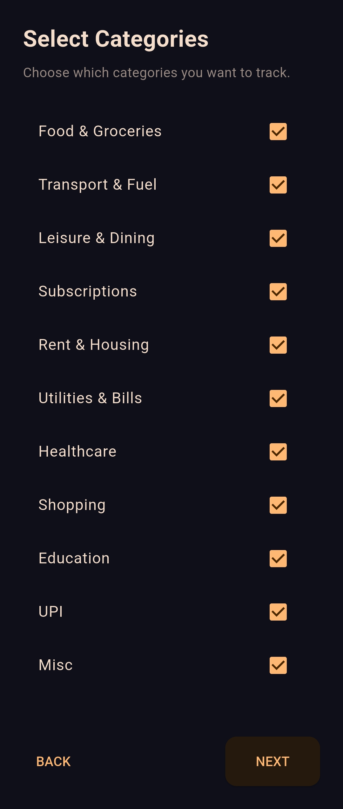
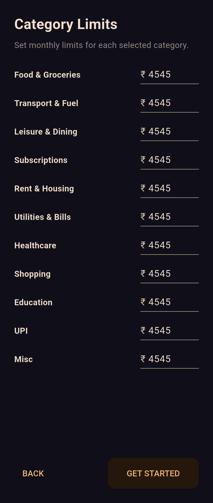
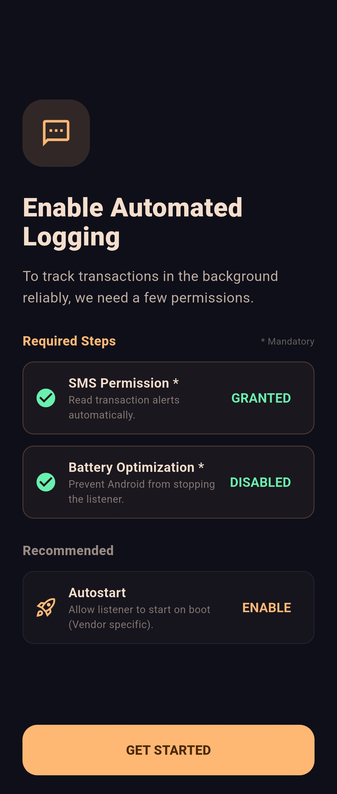
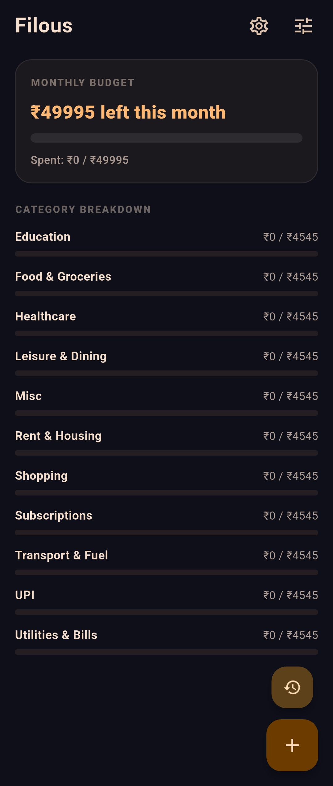
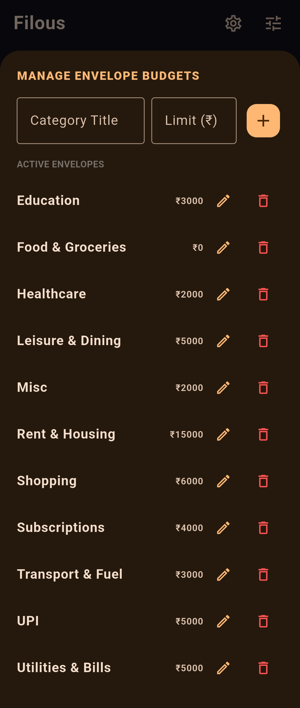

<h2>Spending Tracker Mode</h2>
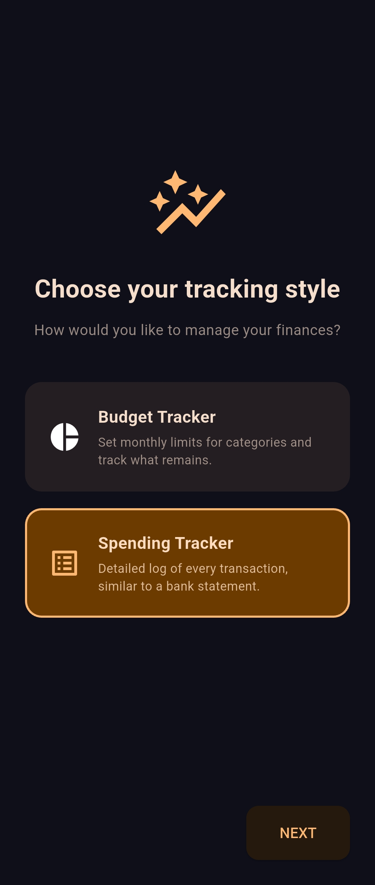
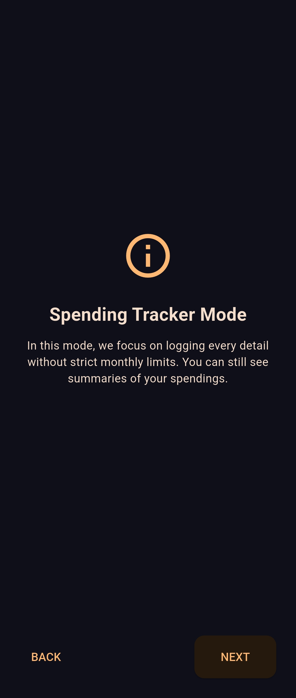
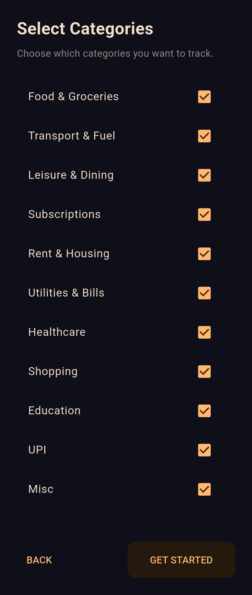

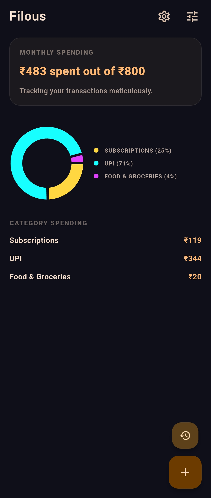

<h2>Common</h2>
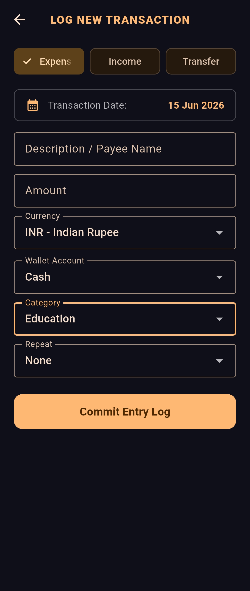
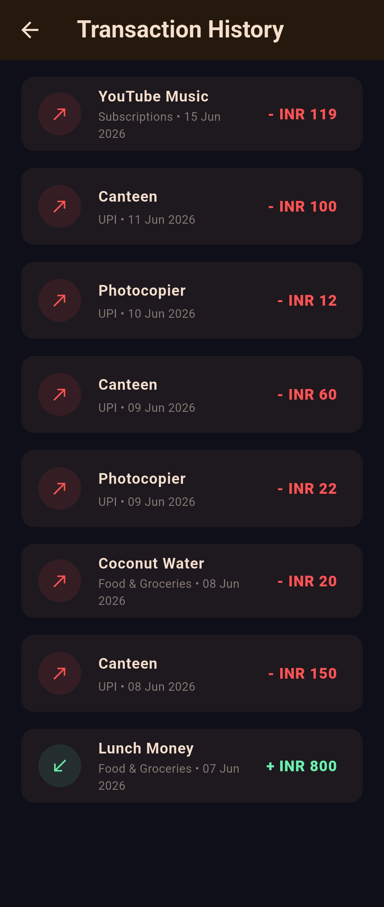
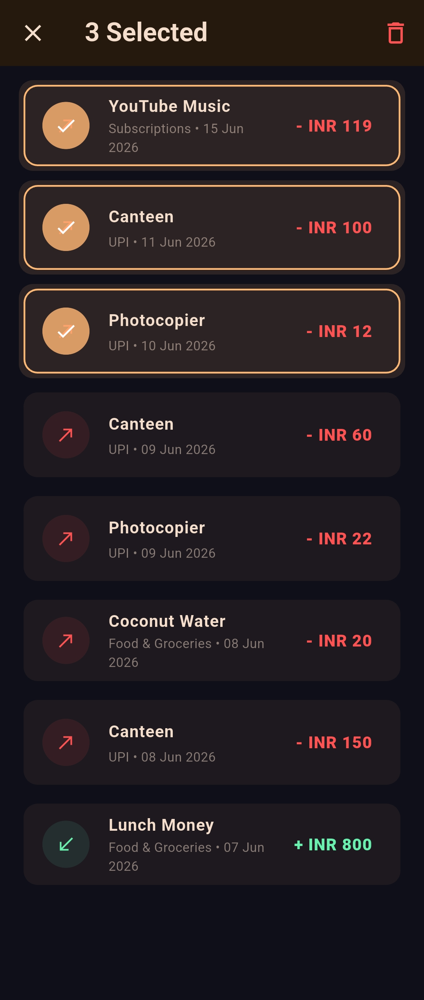
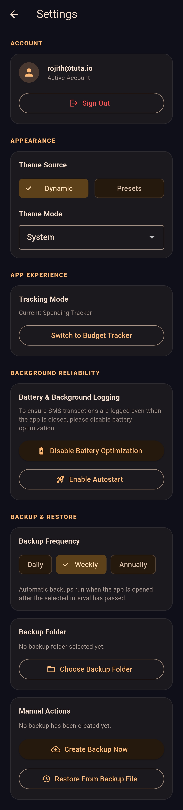

---

<h1>Download Now</h1>

If you face any issues installing the app onto your device due to Play Protect interference, please head to the Play Store and follow these steps:

1. Click your Profile photo on the top right.
2. Click **Play Protect**.
3. Click the **gear icon** on the top right.
4. Toggle the **"Scan apps with Play Protect"** to **OFF**.
5. Toggle the **"Improve harmful app detections"** to **OFF**.
6. Install Filous from the downloaded `.apk` file.
7. Toggle **ON** both settings that were previously disabled.

> [!IMPORTANT]
> **Disclaimer**
> I am not responsible for any threats/malware/viruses installed onto your device after neglecting to re-enabling Play Protect as outlined above. 
> **Filous does NOT contain any malware**, nor does it transmit your personal data to any third-party servers.

---

<h1>Support The Project!</h1>

